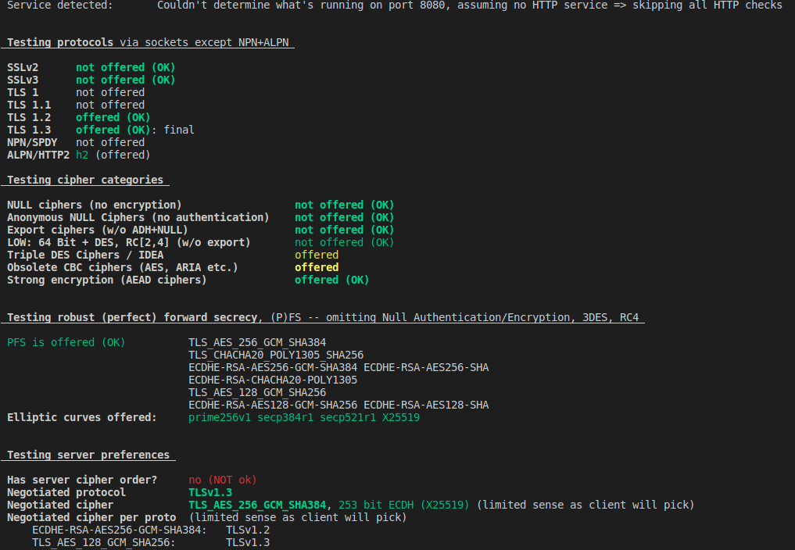

This Go module demonstrates how to secure gRPC with server-authenticated or mutually-authenticated TLS. If you are familiar with TLS, you can skip to [Installing](#Installing).

# Table of Contents

* [Introduction to TLS](#Introduction-to-TLS)<br/>
* [Installing](#Installing)<br/>
* [Building and Running the gRPC Server](#Building-and-Running-the-gRPC-Server)<br/>
* [TLS Report](#TLS-Report)<br/>
* [This Module As a Project Template](#This-Module-As-a-Project-Template)<br/>
* [Cleanup](#Cleanup)<br/>

# Introduction to TLS

TLS is a protocol to secure a TCP connection between a client and a server. The simplest form of TLS only encrypts the connection, so that nobody sniffing the TCP packets en-route between client and servers can make sense of the content. Note that sniffing TCP packets encrypted with TLS still exposes where the packet is going and where it's coming from (both IP addresses). This is called **unauthenticted TLS**.

The next level in security is to use **server-authenticated TLS**, where the client is assured of the authenticity of the server to prevent a man-in-the-middle type of attack. That is, if a client is sending payment information to a server, the client probably wants to know for sure that the server is who they say they are, communicated with encryption is not enough. Hence the authentication. In some applications the server also validates the authenticity of the client, this is called **mutually-authenticated TLS**. Of course these authenticated TLS also encrypt the TCP packets.

Encrypting packets is done by exchanging cryptographic keys during the TLS handshake in such a way as to make it possible only for the client and server to have the session keys. I won't cover the details, there are many types of **key-exchange** algorithms.

A recipient establishes authenticity of a sender by asking for the sender to send a certificate. Certificates contain an **issuer** and a **subject**. The issuer is the identity of who signed the certificate. The subject is who that certificate is for. When the issuer of the sender's certificate is trusted by the recipient, this establishes authenticity. E.g. I trust John, you Joe are sending me a certificate signed by John for Joe, so now I trust you Joe. It's one step more complicated than this, we don't want Alfred pretending to be John just because Alfred has posession of Joe's certificate. A certificate is actually associated with a key that is kept private. So John can freely send his certificate to recipents to establish trust, but never sends the associated private key. The recipient can establish authenticity of the sender by asking the sender to answer a challenge. The sender can only properly answer that challenge if they have possesion of the private key, possesion of the certificate is not sufficient.

Either the receiving application embeds the same CA certificate used to sign the sender's certificate, or the receiving application needs to trust a CA certificate CA1, issued by another CA certificate CA2, and CA2 issued the sender's certificate. This is called **chain-of-trust**. Typically that chain of trust ends with the CA certificate of a commercial certificate authority that everyone trusts like Verisign, Let's Encrypt. But when the same software vendor develops both the client and the server application, both can embed a self-signed CA certificate and there is no need for a certificate authority.

To establish server-authenticated TLS in a project where you develop both client and server, you will need to create a self-signed CA certificate, hereby called root CA, then create a server certificate issued (signed by) by that root CA. You'll then embed the server certificate and associated private key on the server, and embed the root CA certificate (Without its private key) on the client. To add mutual authentication you create a client certificate issued by the root CA, embed that client certificate and associated private key on the client, and embed the root CA (without private key) on the server. Finally the private key associated with the root CA you keep elsewhere, neither the server nor the client need it. You need it only if you ever want to issue new certificates. 

All this is fine to get you started, but obviously, if you are building a service, and this is your first time with TLS, before you deploy to production, you'll want to have your company's security team review how you configured TLS, this is a complicated topic and if you don't know what you're doing you can easily do the wrong thing. What this project is about is getting you started because it's easy to spend too much time where all TLS handshakes fail early in a project.

# Installing
Before building and running this module, you need to generate x509 certificates into `./secrets/` and download this module's dependencies into `./vendor/` via:
``` 
make install
```

# Building and Running the gRPC Server

By default this project uses server-authenticated TLS. If you want to use mutually-authenticated TLS you define environment variable `USE_MTLS=1`. The following builds then runs the gRPC server in a docker container.
```
USE_MTLS=1 docker-compose up
```
The server is named greeter, is listening on port 8080, and is attached to a docker network. A client container is also started and attached to that network. Port 8080 on your localhost is mapped to greeter:8080 which can be useful to point local tools such as `openssl` to the server.

You can now open another terminal, and shell into the client container via:
```
make shell-client
```
In that container you may run `greeter-client -url greeter:8080` to send a gRPC request, and observe the response. Note that if you switch to the first terminal you can observe the server's logs on stdout, showing the reception of a gRPC request, e.g. 

on the client:
```
2020/09/17 21:47:39 Dialing greeter:8080
2020/09/17 21:47:39 Succeeded in connecting to greeter service
2020/09/17 21:47:39 Greeter responded with:  Hello Go client
```

on the server:
```
2020/09/17 21:47:39 Greeter.SayHello
```

In that client shell, you may also debug TLS with `openssl s_client -connect greeter:8080` if you needed to do something more advanced.

If you needed to debug something on the server, you can shell into the server via
```
make shell-server
```

# TLS Report
You may obtain a detailed TLS report of the greeter:8080 endpoint by doing `docker pull drwetter/testssl.sh:3.0` followed by `make testssl` while the server is running. That will run [https://github.com/drwetter/testssl.sh](https://github.com/drwetter/testssl.sh) inside a docker container attached to the same docker network as the greeter server.

. 

# This Module As a Project Template
For this demo to work in your environment you will need to make a change to `~/scripts/server.conf` and change the `[dn]` and `[alt_names]`. The DNS names must match the host name of your server for the server certificate to be accepted by your client. The TLS handshake would fail otherwise.

Configuring `server.conf` for various environments is beyond the scope of this demo. You can configure the server certificate for a list of IP addresses instead of hostnames. You can configure it for different cryptographic algorithms etc... Search for `openssl` documentation on that subject.

The x509 certificates used here are self-signed, which means this demo is applicable to scenarios where you distribute both the server and the client and are able to embed the root CA certificate on the client. More advanced configuration would use a chain of trust with a commercial CA. An even more avanced configuration would be mutual TLS where the server authenticates the client.

Some useful commands to debug TLS issues when porting this project to your environment:
* `getent hosts [hostname]` to verify if a given hostname is known and find the IP
* `ip addr show` to show the network interfaces
* `hostname -f` to show this hostname's full qualified name, and `hostname -d` to show the domain name
* `netstat -nlt` to confirm a port is being listened on by your server, or confirm docker is forwarding a port to a container
* `docker inspect [container name]` to find the IP of a container
* `bridge link`
* `openssl s_client [flags] -connect [hostname]:[port]` to debug TLS. Use flags to peg the TLS version to a specific version, or pass a different CA certificate. If you can connect with s_client, your problem is likely with your client application. If you can't, perhaps the server is misconfigured. This tool points you in the right direction. Also use the `-msg` flag to see the exchanges, and narrow down the problem to say, "the server does not accept the client certificate". Then you know either the client isn't sending a cert, or that cert isn't signed by the CA, or the server isn't using the same CA.

# Cleanup
When you're done you can run `docker-compose down` to stop both containers, and `make clean` will delete the vendor/ and secrets/ folders, and remove the docker images.
